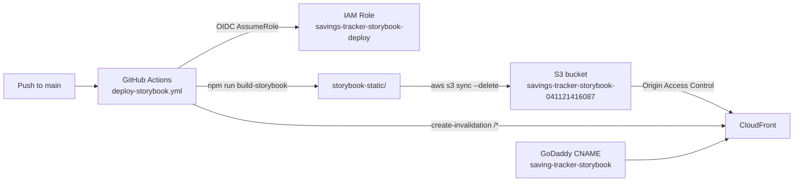

# Storybook CI/CD — DevOps Runbook

Storybook is deployed as a static site to AWS and served at
**https://saving-tracker-storybook.aserputko.com**.

> Deploying the **web app** (DEV / STAGING / PRODUCTION) is a separate stack —
> see [README-webapp.md](README-webapp.md).



| Component                     | Value                                                               |
| ----------------------------- | ------------------------------------------------------------------- |
| AWS account                   | `041121416087`                                                      |
| Region                        | `us-east-1`                                                         |
| S3 bucket (private, OAC-only) | `savings-tracker-storybook-041121416087`                            |
| CloudFront alias              | `saving-tracker-storybook.aserputko.com`                            |
| TLS certificate               | existing ACM cert for `*.aserputko.com` (looked up, never modified) |
| GitHub auth                   | OIDC — no AWS keys stored in GitHub                                 |
| Terraform state               | local file in `devops/terraform-storybook/` (gitignored)            |

---

## 1. Prerequisites (one-time, local machine)

1. **Terraform >= 1.6** — `brew install terraform` (or `tfenv`).
2. **AWS CLI v2** authenticated against account `041121416087` with rights to
   create S3/CloudFront/IAM resources:

   ```bash
   aws sts get-caller-identity
   # "Account": "041121416087"
   ```

3. **GitHub CLI** (optional, for setting repo variables from the terminal) —
   `brew install gh`, then `gh auth login`.
4. Verify the wildcard certificate exists and is **ISSUED in us-east-1**
   (CloudFront cannot use certificates from any other region):

   ```bash
   aws acm list-certificates --region us-east-1 \
     --query "CertificateSummaryList[?DomainName=='*.aserputko.com']"
   ```

   If this returns `[]`, request/import the certificate in `us-east-1` before
   continuing.

## 2. Provision the infrastructure with Terraform

All commands run from this folder's `terraform-storybook/` subdirectory:

```bash
cd fe-savings-tracker/devops/terraform-storybook

terraform init      # downloads the AWS provider
terraform plan      # review: S3 bucket, CloudFront, OIDC provider, IAM role
terraform apply     # type "yes" to confirm
```

All variables have sensible defaults ([variables.tf](./variables.tf)).
To override any of them, copy
[terraform.tfvars.example](./terraform.tfvars.example) to
`terraform.tfvars` and edit it (the file is gitignored).

### If apply fails with `EntityAlreadyExists` for the OIDC provider

The GitHub OIDC identity provider is account-wide, so another project may have
created it already. Import it and re-apply:

```bash
terraform import aws_iam_openid_connect_provider.github \
  arn:aws:iam::041121416087:oidc-provider/token.actions.githubusercontent.com
terraform apply
```

### Outputs

After `apply`, note the outputs (re-print anytime with `terraform output`):

| Output                       | Used for                                     |
| ---------------------------- | -------------------------------------------- |
| `deploy_role_arn`            | GitHub variable `AWS_ROLE_ARN`               |
| `s3_bucket_name`             | GitHub variable `S3_BUCKET`                  |
| `cloudfront_distribution_id` | GitHub variable `CLOUDFRONT_DISTRIBUTION_ID` |
| `cloudfront_domain_name`     | GoDaddy CNAME target                         |
| `godaddy_cname_record`       | Full DNS record to create                    |
| `storybook_url`              | Final URL                                    |

> CloudFront takes ~5–10 minutes to finish deploying after `apply`.

## 3. Configure GitHub repository variables

The workflow reads three **Actions variables** (not secrets — none of these
values are sensitive) from the `aserputko/fe-savings-tracker` repo.

With the GitHub CLI (substitute the values from `terraform output`):

```bash
gh variable set AWS_ROLE_ARN \
  --repo aserputko/fe-savings-tracker \
  --body "$(terraform output -raw deploy_role_arn)"

gh variable set S3_BUCKET \
  --repo aserputko/fe-savings-tracker \
  --body "$(terraform output -raw s3_bucket_name)"

gh variable set CLOUDFRONT_DISTRIBUTION_ID \
  --repo aserputko/fe-savings-tracker \
  --body "$(terraform output -raw cloudfront_distribution_id)"
```

Or via the UI: repo → **Settings → Secrets and variables → Actions →
Variables tab → New repository variable**.

## 4. Create the DNS record in GoDaddy (one-time, manual)

Terraform cannot manage GoDaddy DNS, so add one record by hand
(`terraform output godaddy_cname_record` prints these values):

1. GoDaddy → **My Products → aserputko.com → DNS**.
2. **Add New Record**:
   - **Type**: `CNAME`
   - **Name/Host**: `saving-tracker-storybook`
   - **Value**: the `cloudfront_domain_name` output (e.g. `d1234abcd.cloudfront.net`)
   - **TTL**: 600 seconds (or the default)
3. Save. Propagation is usually minutes, up to an hour.

Verify:

```bash
dig +short saving-tracker-storybook.aserputko.com
# should resolve to the CloudFront domain / its IPs
```

## 5. First deployment

Either:

- **Manual**: GitHub → **Actions → Deploy Storybook → Run workflow** (branch `main`), or
- **Automatic**: push/merge any commit to `main`.

The workflow ([.github/workflows/deploy-storybook.yml](../.github/workflows/deploy-storybook.yml)):

1. `npm ci` + `npm run build-storybook` → `storybook-static/`
2. Assumes `deploy_role_arn` via OIDC (only `main` of this repo is trusted)
3. `aws s3 sync storybook-static/ s3://<bucket> --delete`
4. `aws cloudfront create-invalidation --paths "/*"`

Verify:

```bash
open https://saving-tracker-storybook.aserputko.com
```

Direct S3 access must stay blocked (this is expected):

```bash
curl -I https://savings-tracker-storybook-041121416087.s3.amazonaws.com/index.html
# HTTP 403
```

## 6. Day-to-day operation

- Every push to `main` redeploys Storybook automatically.
- Re-run manually anytime from the Actions tab (`workflow_dispatch`).
- Full `/*` invalidation is used per deploy; the first 1,000 invalidation
  paths per month are free.

## 7. Teardown

The bucket must be emptied before it can be destroyed:

```bash
cd fe-savings-tracker/devops/terraform
aws s3 rm "s3://$(terraform output -raw s3_bucket_name)" --recursive
terraform destroy
```

Then delete the GoDaddy CNAME record and the three GitHub variables.

> If the OIDC provider was **imported** (shared with other projects), remove it
> from state first so destroy doesn't delete it account-wide:
> `terraform state rm aws_iam_openid_connect_provider.github`

## Troubleshooting

| Symptom                                                                                                  | Cause / fix                                                                                                                                                                                                                                                                                                                                                                                                  |
| -------------------------------------------------------------------------------------------------------- | ------------------------------------------------------------------------------------------------------------------------------------------------------------------------------------------------------------------------------------------------------------------------------------------------------------------------------------------------------------------------------------------------------------ |
| `terraform plan` fails: no matching ACM certificate                                                      | Cert missing or not `ISSUED` in `us-east-1`. See step 1.4.                                                                                                                                                                                                                                                                                                                                                   |
| `apply` fails: `EntityAlreadyExists` on OIDC provider                                                    | Provider already exists in the account — import it (step 2).                                                                                                                                                                                                                                                                                                                                                 |
| `apply` fails: `AccessDenied: Your account must be verified before you can add new CloudFront resources` | Account-level AWS restriction on new accounts. Open a free support case: [AWS Support Center](https://console.aws.amazon.com/support/home#/) → **Create case → Account and billing → Account → Activation**, paste the error message and ask for CloudFront verification of account `041121416087`. Once resolved (usually within ~24h), re-run `terraform apply` — already-created resources are untouched. |
| Workflow fails: `Not authorized to perform sts:AssumeRoleWithWebIdentity`                                | Run is not on `main` of `aserputko/fe-savings-tracker`, or `AWS_ROLE_ARN` variable is wrong/missing.                                                                                                                                                                                                                                                                                                         |
| Workflow fails: `Credentials could not be loaded`                                                        | `permissions: id-token: write` removed from the workflow, or role trust policy changed.                                                                                                                                                                                                                                                                                                                      |
| Site shows old content after deploy                                                                      | Invalidation still propagating (~1–5 min); hard-refresh the browser.                                                                                                                                                                                                                                                                                                                                         |
| `403` / certificate error in browser                                                                     | CloudFront still deploying (~10 min after apply), or GoDaddy CNAME missing/typo'd.                                                                                                                                                                                                                                                                                                                           |
| Custom domain works but `dxxxx.cloudfront.net` shows cert warning                                        | Expected — the wildcard cert only covers `*.aserputko.com`.                                                                                                                                                                                                                                                                                                                                                  |
