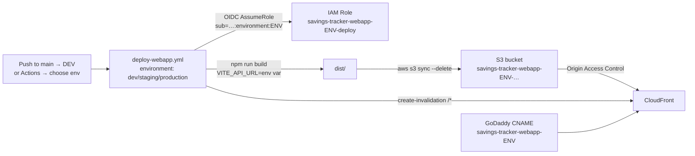

# Web App CI/CD — DevOps Runbook

The React/Vite web app is built with `npm run build` and deployed as a static
site to AWS S3 + CloudFront, across **three environments**:

| Environment | URL                                        | S3 bucket (private, OAC-only)            | IAM deploy role                     |
| ----------- | ------------------------------------------ | ---------------------------------------- | ----------------------------------- |
| DEV         | `savings-tracker-webapp-dev.aserputko.com` | `savings-tracker-webapp-dev-<accountId>` | `savings-tracker-webapp-dev-deploy` |
| STAGING     | `savings-tracker-webapp-stg.aserputko.com` | `savings-tracker-webapp-stg-<accountId>` | `savings-tracker-webapp-stg-deploy` |
| PRODUCTION  | `savings-tracker-webapp.aserputko.com`     | `savings-tracker-webapp-<accountId>`     | `savings-tracker-webapp-deploy`     |

> Storybook has its own separate stack and runbook — see [README.md](README.md).



| Component       | Value                                                                        |
| --------------- | ---------------------------------------------------------------------------- |
| AWS account     | `041121416087`                                                               |
| Region          | `us-east-1`                                                                  |
| TLS certificate | existing ACM wildcard cert for `*.aserputko.com` (looked up, never modified) |
| GitHub auth     | OIDC — no AWS keys stored in GitHub                                          |
| Env isolation   | one S3 bucket + CloudFront + IAM role **per environment**                    |
| Terraform state | local, one **workspace per environment** (`terraform.tfstate.d/<env>/`)      |
| Deploy trigger  | auto → DEV on merge to `main`; manual `workflow_dispatch` for any env        |

---

## 1. Prerequisites (one-time, local machine)

1. **Terraform >= 1.6** — `brew install terraform` (or `tfenv`).
2. **AWS CLI v2** authenticated against account `041121416087` with rights to
   create S3/CloudFront/IAM resources:

   ```bash
   aws sts get-caller-identity   # "Account": "041121416087"
   ```

3. **GitHub CLI** (optional, for setting variables from the terminal) —
   `brew install gh`, then `gh auth login`.
4. The wildcard certificate must exist and be **ISSUED in us-east-1**
   (CloudFront cannot use certificates from any other region):

   ```bash
   aws acm list-certificates --region us-east-1 \
     --query "CertificateSummaryList[?DomainName=='*.aserputko.com']"
   ```

5. The **GitHub OIDC provider** must already exist in the account. It is
   account-wide and is created/managed by the Storybook stack
   ([terraform/github-oidc.tf](terraform/github-oidc.tf)); this stack only
   references it. If you are starting from a fresh account, apply the Storybook
   stack first (or import the provider there) so it exists.

## 2. Provision the infrastructure with Terraform (workspaces = environments)

Each environment lives in its own Terraform **workspace** so their state never
collides. All commands run from `terraform-webapp`:

```bash
cd fe-savings-tracker/devops/terraform-webapp

terraform init

# DEV
terraform workspace new dev          # first time only (later: workspace select dev)
terraform apply -var-file=dev.tfvars

# STAGING
terraform workspace new staging      # first time only
terraform apply -var-file=staging.tfvars

# PRODUCTION
terraform workspace new production   # first time only
terraform apply -var-file=production.tfvars
```

Switch between environments any time with `terraform workspace select <env>`,
and confirm which one you're on with `terraform workspace show`.

> Always keep the workspace and the `-var-file` in sync (workspace `dev` ⇄
> `dev.tfvars`). The `environment` value in the tfvars drives every resource
> name, so a mismatch would create the wrong resources in that workspace's state.

### Outputs (per environment)

After each `apply`, note the outputs (re-print with `terraform output`):

| Output                       | Used for                                                        |
| ---------------------------- | --------------------------------------------------------------- |
| `deploy_role_arn`            | `AWS_ROLE_ARN` variable on the matching GitHub Environment      |
| `s3_bucket_name`             | `S3_BUCKET` variable on the matching GitHub Environment         |
| `cloudfront_distribution_id` | `CLOUDFRONT_DISTRIBUTION_ID` on the matching GitHub Environment |
| `cloudfront_domain_name`     | GoDaddy CNAME target for that environment                       |
| `godaddy_cname_record`       | Full DNS record to create                                       |
| `webapp_url`                 | Final URL                                                       |

> CloudFront takes ~5–10 minutes to finish deploying after each `apply`.

## 3. Configure GitHub Environments and variables

The deploy workflow ([../.github/workflows/deploy-webapp.yml](../.github/workflows/deploy-webapp.yml))
pins each run to a **GitHub Environment** (`environment: ${{ inputs.environment }}`).
This does two things: it scopes `vars.*` to that environment (so a web-app deploy
never picks up Storybook's repo-level variables), and it sets the OIDC subject
the IAM role trusts (`repo:aserputko/fe-savings-tracker:environment:<env>`).

### 3a. Create the three Environments (one-time)

GitHub → repo **Settings → Environments → New environment**, and create exactly:

- `dev`
- `staging`
- `production`

(Names must match the workflow dropdown and the Terraform `environment` values.)

Optionally harden `production`: add **required reviewers** and/or a **deployment
branch policy** restricting it to `main`.

### 3b. Add variables for each environment (the important part)

Every environment needs its **own** four variables. These are **Variables**, not
Secrets — none are sensitive. Set them at the **Environment** level (not the repo
level), because the repo level already holds Storybook's values.

| Variable                     | Source                                             |
| ---------------------------- | -------------------------------------------------- |
| `AWS_ROLE_ARN`               | `terraform output -raw deploy_role_arn`            |
| `S3_BUCKET`                  | `terraform output -raw s3_bucket_name`             |
| `CLOUDFRONT_DISTRIBUTION_ID` | `terraform output -raw cloudfront_distribution_id` |
| `VITE_API_URL`               | The API base URL for that environment (see below)  |

**Via the UI:** repo → **Settings → Environments → `<env>` → Environment
variables → Add variable**, for each of the four names.

**Via the GitHub CLI** (note the `--env` flag — this is what scopes it):

```bash
cd fe-savings-tracker/devops/terraform-webapp
ENV=dev                                   # repeat for staging / production
terraform workspace select "$ENV"

gh variable set AWS_ROLE_ARN               --repo aserputko/fe-savings-tracker --env "$ENV" --body "$(terraform output -raw deploy_role_arn)"
gh variable set S3_BUCKET                  --repo aserputko/fe-savings-tracker --env "$ENV" --body "$(terraform output -raw s3_bucket_name)"
gh variable set CLOUDFRONT_DISTRIBUTION_ID --repo aserputko/fe-savings-tracker --env "$ENV" --body "$(terraform output -raw cloudfront_distribution_id)"

# TODO: replace with the real API URL for this environment.
gh variable set VITE_API_URL               --repo aserputko/fe-savings-tracker --env "$ENV" --body "https://api-dev.example.com"
```

Suggested `VITE_API_URL` placeholders to replace with your real API endpoints:

| Environment | `VITE_API_URL` (TODO — set to your API)   |
| ----------- | ----------------------------------------- |
| dev         | `https://api-dev.savings-tracker.example` |
| staging     | `https://api-stg.savings-tracker.example` |
| production  | `https://api.savings-tracker.example`     |

> `VITE_API_URL` is read by the app at **build time**
> ([src/api/useAPI.ts](../src/api/useAPI.ts)) and baked into the bundle. When it
> is unset (local `npm run dev` and tests) the app falls back to
> `http://localhost:4000`. Changing it requires a redeploy of that environment.
>
> The deploy job fails fast if any of the four variables is missing on the
> selected environment, so a misconfigured environment can't silently deploy the
> wrong bundle.

## 4. Create the DNS records in GoDaddy (one-time, manual)

Terraform cannot manage GoDaddy DNS, so add one CNAME per environment
(`terraform output godaddy_cname_record` prints the exact values for the current
workspace):

| Type  | Name/Host                    | Value (from `cloudfront_domain_name`) |
| ----- | ---------------------------- | ------------------------------------- |
| CNAME | `savings-tracker-webapp-dev` | `dXXXXdev.cloudfront.net`             |
| CNAME | `savings-tracker-webapp-stg` | `dXXXXstg.cloudfront.net`             |
| CNAME | `savings-tracker-webapp`     | `dXXXXprod.cloudfront.net`            |

GoDaddy → **My Products → aserputko.com → DNS → Add New Record** (TTL 600 or
default). Verify propagation:

```bash
dig +short savings-tracker-webapp-dev.aserputko.com
```

## 5. Deploy

**Automatic (DEV):** every merge/push to `main` runs the workflow and deploys to
the **dev** environment — no inputs needed.

**Manual (any env):** GitHub → **Actions → Deploy Web App → Run workflow**, pick
the **environment** (`dev` / `staging` / `production`) and run.

Either way, the workflow
([../../.github/workflows/deploy-webapp.yml](../../.github/workflows/deploy-webapp.yml)):

1. `npm ci` + `npm run build` (with that environment's `VITE_API_URL`) → `dist/`
2. Assumes `AWS_ROLE_ARN` via OIDC (only runs targeting this environment are trusted)
3. `aws s3 sync dist/ s3://<bucket> --delete`
4. `aws cloudfront create-invalidation --paths "/*"`

Verify:

```bash
open https://savings-tracker-webapp-dev.aserputko.com
```

Direct S3 access must stay blocked (this is expected):

```bash
curl -I https://savings-tracker-webapp-dev-041121416087.s3.amazonaws.com/index.html
# HTTP 403
```

## 6. Adding a new environment later

1. Add the environment key to the `subdomain` map in
   [./locals.tf](./locals.tf) and to the
   `environment` validation list in
   [./variables.tf](./variables.tf).
2. Add a `<env>.tfvars` file (copy an existing one).
3. `terraform workspace new <env> && terraform apply -var-file=<env>.tfvars`.
4. Add the value to the workflow's `environment` dropdown `options`.
5. Create the matching GitHub Environment + its four variables (section 3).
6. Add the GoDaddy CNAME (section 4).

## 7. Teardown (per environment)

A bucket must be emptied before it can be destroyed:

```bash
cd fe-savings-tracker/devops/terraform-webapp
terraform workspace select dev
aws s3 rm "s3://$(terraform output -raw s3_bucket_name)" --recursive
terraform destroy -var-file=dev.tfvars
```

Then delete that environment's GoDaddy CNAME and its GitHub Environment variables.

> The OIDC provider is **not** managed here (it's a shared data source), so
> `destroy` never removes it.

## Troubleshooting

| Symptom                                                                   | Cause / fix                                                                                             |
| ------------------------------------------------------------------------- | ------------------------------------------------------------------------------------------------------- |
| `terraform plan` fails: no matching ACM certificate                       | Wildcard cert missing or not `ISSUED` in `us-east-1` (§1.4).                                            |
| `terraform plan` fails: no matching OIDC provider                         | Provider doesn't exist yet — apply the Storybook stack / import it first (§1.5).                        |
| Deploy fails: `Set <VAR> as a variable on the '<env>' GitHub Environment` | A required variable is missing on that Environment — set all four (§3b).                                |
| Deploy fails: `Not authorized to perform sts:AssumeRoleWithWebIdentity`   | Run didn't target the environment (missing `environment:`), or `AWS_ROLE_ARN` points at the wrong role. |
| Deploy fails: `Credentials could not be loaded`                           | `permissions: id-token: write` removed, or role trust changed.                                          |
| App calls `localhost:4000` in a deployed env                              | `VITE_API_URL` wasn't set on that Environment before the build — set it and redeploy.                   |
| Site shows old content after deploy                                       | Invalidation still propagating (~1–5 min); hard-refresh.                                                |
| `403` / cert error in browser                                             | CloudFront still deploying (~10 min after apply), or the GoDaddy CNAME is missing/typo'd.               |
| Deep link (e.g. `/goals/123`) 404s                                        | Expected to work via the 403/404 → `/index.html` fallback; if not, confirm the custom error responses.  |
